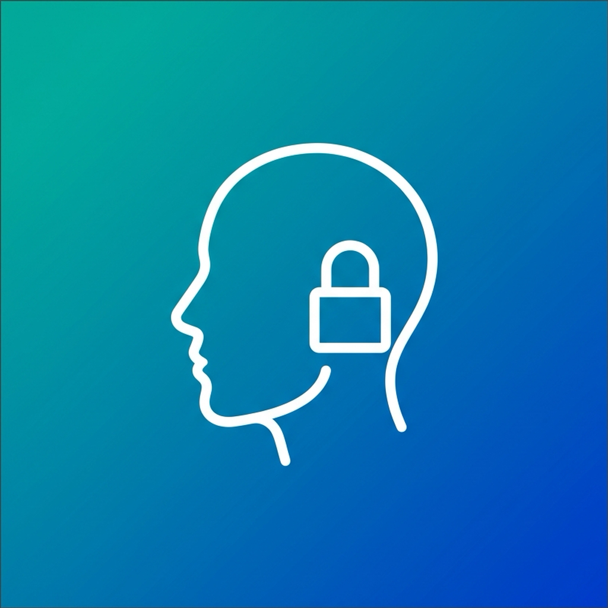

<p align="center">
  
</p>

<h1 align="center">ProximityLock</h1>

<p align="center">
  <strong>Lock your Mac or PC automatically when you walk away.</strong><br>
  Face detection powered by AI — no cloud, no account, 100% local.
</p>

<p align="center">
  <a href="https://github.com/DanielGutierrezB/ProximityLock/releases/latest">
    
  </a>
  
  
  
</p>

---

## What is ProximityLock?

ProximityLock watches for your face using your computer's camera. When you walk away and your face isn't detected for a few seconds, it locks your screen automatically. When you come back, just unlock normally.

Everything runs **locally on your machine** — no data is sent anywhere, no account needed.

---

## Download

👉 **[Download latest release](https://github.com/DanielGutierrezB/ProximityLock/releases/latest)**

| Platform | File | Requirements |
|----------|------|-------------|
| 🍎 **macOS** | `ProximityLock-1.0.0-macOS-AppleSilicon.dmg` | macOS 12+, Apple Silicon (M1/M2/M3/M4) |
| 🪟 **Windows** | `ProximityLock-Setup-1.0.0-Windows-x64.exe` | Windows 10+, 64-bit |

---

## Installation & Setup

### 🍎 macOS

#### Step 1: Install
1. Download the `.dmg` file
2. Open it and drag **ProximityLock** to your **Applications** folder

#### Step 2: First launch (important!)
The app is not signed with an Apple Developer certificate, so macOS will block it the first time.

**Option A — Right-click method:**
1. Go to **Applications** in Finder
2. **Right-click** (or Control+click) on ProximityLock
3. Click **Open**
4. In the dialog that appears, click **Open** again

**Option B — Terminal (if Option A doesn't work):**
```bash
xattr -cr /Applications/ProximityLock.app
open /Applications/ProximityLock.app
```

#### Step 3: Grant camera permission
1. macOS will ask for **Camera access** — click **Allow**
2. If you accidentally denied it: go to **System Settings → Privacy & Security → Camera** and enable ProximityLock

#### Step 4: Grant screen lock permission (if needed)
If the screen doesn't lock automatically:
1. Go to **System Settings → Privacy & Security → Accessibility**
2. Add ProximityLock to the list

#### Step 5: Set password on wake
Make sure your Mac requires a password after sleep/screen saver:
1. **System Settings → Lock Screen**
2. Set "Require password after screen saver begins or display is turned off" to **Immediately**

---

### 🪟 Windows

#### Step 1: Install
1. Download the `.exe` installer
2. Run it — Windows may show a SmartScreen warning since the app isn't signed
3. Click **"More info"** → **"Run anyway"**
4. Follow the installation wizard

#### Step 2: Grant camera permission
1. Windows will ask for camera access on first use — click **Allow**
2. If needed: go to **Settings → Privacy → Camera** and make sure apps can access the camera

#### Step 3: That's it!
Windows locks the screen using the built-in `LockWorkStation` command — no extra permissions needed.

---

## How to Use

### 1. Select a camera
Choose your camera from the dropdown. The preview will start immediately.

### 2. Enroll your face
Click **"Take Photo"** to capture your face. This creates a local face descriptor that ProximityLock uses to recognize you.

### 3. Adjust settings

| Setting | What it does | Recommended |
|---------|-------------|-------------|
| **Match threshold** | How similar a face must be to count as "you". Lower = more lenient. | 35-50% |
| **Lock delay** | Seconds without your face before the screen locks. | 3-5s |

### 4. Start monitoring
Click **▶ Start Monitoring**. The app will now:
- Show 🟢 **Matched X%** when it sees you
- Show 🔴 **Locking in Xs…** when it doesn't
- Lock your screen after the delay expires

### 5. Menu bar / System tray
ProximityLock lives in your menu bar (macOS) or system tray (Windows). Click the icon for quick access to:
- Camera selection
- Match threshold & lock delay sliders
- Start/Stop monitoring
- Lock Now button

---

## Features

- 📷 **Real-time face detection** — see your match percentage live
- 🔒 **Auto-lock** — configurable delay from 1 to 30 seconds
- 🎯 **Adjustable sensitivity** — match threshold from 20% to 80%
- 👁 **Preview toggle** — detection works even with preview off
- 📊 **Live status** — menu bar shows match % or countdown
- 🔋 **Battery-friendly** — pauses camera when screen is locked
- 🚀 **Auto-start** — optional, remembers your preference
- 🔔 **Notifications** — get notified when the screen locks
- 🌐 **Cross-platform** — macOS and Windows

---

## Privacy & Security

- ✅ **100% local** — all face detection runs on your machine
- ✅ **No cloud** — nothing is sent to any server
- ✅ **No account** — no sign-up required
- ✅ **Face data stays local** — stored in your app data folder only
- ✅ **Camera pauses on lock** — saves battery and CPU
- ✅ **Open source** — review the code yourself

Face descriptors are stored in:
- **macOS:** `~/Library/Application Support/proximitylock/`
- **Windows:** `%APPDATA%/proximitylock/`

---

## Building from Source

```bash
git clone https://github.com/DanielGutierrezB/ProximityLock.git
cd ProximityLock
npm install

# Development
npm run dev

# Build for your platform
npm run build

# Build for Windows (cross-compile from macOS)
npx electron-builder --win --x64
```

---

## Tech Stack

- [Electron](https://www.electronjs.org/) — desktop app framework
- [@vladmandic/human](https://github.com/vladmandic/human) — face detection & recognition (WebGPU/WebGL)
- [electron-builder](https://www.electron.build/) — packaging & distribution
- [electron-store](https://github.com/sindresorhus/electron-store) — persistent preferences

---

## Troubleshooting

### macOS: "ProximityLock can't be opened"
Run in Terminal: `xattr -cr /Applications/ProximityLock.app`

### macOS: Screen doesn't lock
1. Check **System Settings → Lock Screen** — password must be required immediately
2. Check **System Settings → Privacy & Security → Accessibility** — add ProximityLock

### Windows: "Windows protected your PC"
Click **"More info"** → **"Run anyway"**. This happens because the app isn't signed.

### Camera not detected
Make sure camera permissions are granted in your OS privacy settings.

### Low match percentage
- Retake your enrollment photo in good lighting
- Lower the match threshold
- Make sure the camera has a clear view of your face

---

## License

MIT — © Daniel Gutiérrez
